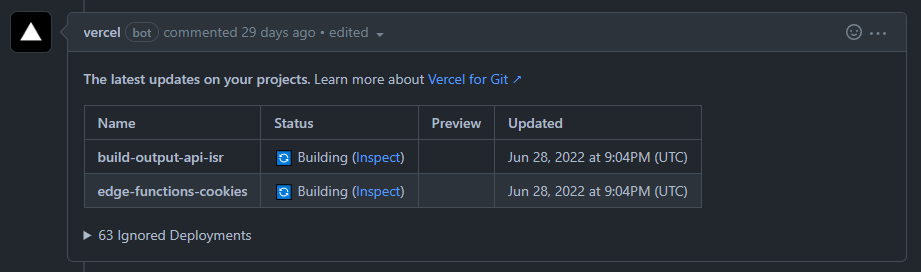
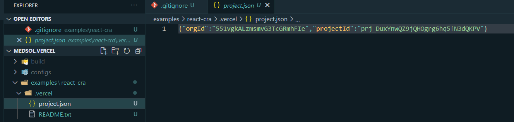
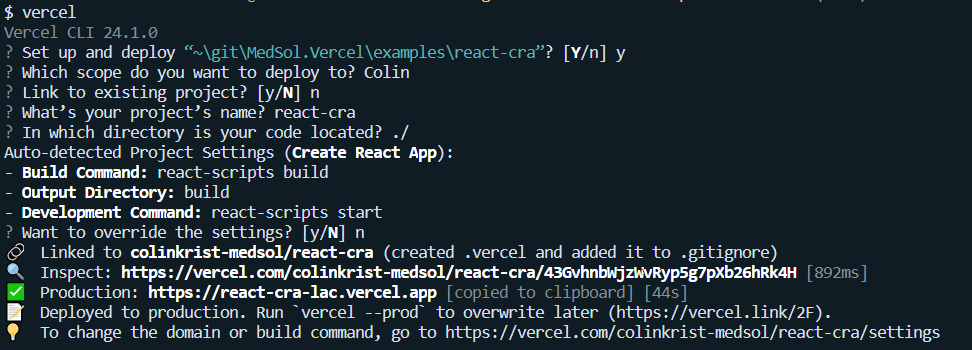
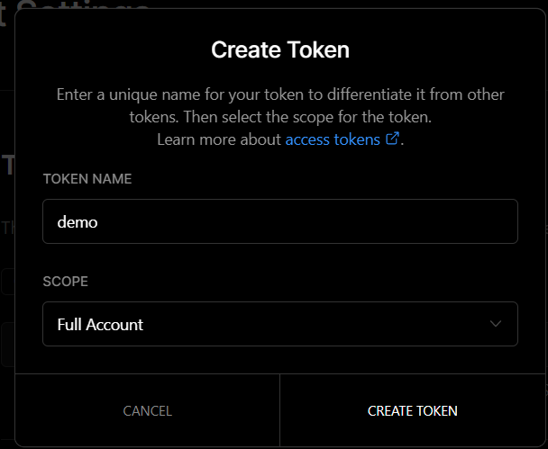

# Vercel for Azure DevOps Pipelines

This extension provides Azure Devops Pipelines Tasks to integrate with Vercel using their @vercel/client npm package

## Why does this exist?

Since Vercel doesn't natively support Azure Repos _(why would they? - don't @ me MS)_, it'd be beneficial for most developers to either maintain a template within their org, or install an extension with a prebuilt step that enables deployments using @vercel/client.

When play testing this package I @ColinKrist realized that creating a org specific template approach wasn't great long term for myself and for the Azure Repos community 👍.

### Dogfood? 😋

Yes, this extension is currently being [dogfooded](https://www.techopedia.com/definition/30784/dogfooding#:~:text=The%20term%20%22dogfooding%22%20is%20an,is%20confident%20about%20its%20products.) @ Medical Solutions - a travel nurse staffing agency. Come work for us - >[here](https://thebestjobieverhad.com/)<

### What is Vercel? 🔼

About Vercel: [link🔗](https://vercel.com/docs)

Ever stumble upon a repo on Github and see one of these bad boys?



They're badass - and now anyone using this Task (or roll your own - source code is MIT) something like this can be done pretty easily.

### What this extension / step does

This extension / "Task Deploy" step pushes code to Vercel and then exposes the final url as a shared pipeline variable. This can then be consumed by something like:

| Name | Link | Author(s) |
| - | - | - |
| Create Pull Request Comment | [link](https://github.com/microsoft/CSEDevOps/tree/main/CreatePrComment) | Microsoft's CSE Dev Team |

which can then create comments for you every time the PR updates. Now, this ain't perfect, may be a bit spammy. PR Metrics - another great extension OSS'ed from within MS for Azure Repos maintains a single comment.

For now, `deploymentUrl` is set for usage by the consumer of the step!

### What this extension / step does NOT do

Provide a PR comment with the deployment link, and have it automatically update with the newest link.

> 🧚‍♀️ TODO? Consider pitching in a PR to do this for us!


---

## Setup & Usage

> ⚠ Contrary to Vercel's documentation - remove the .gitignore entries that get added when the initial Vercel cli setup is ran. (Specifically .vercel in the root of the deployment directory)
>
> 🙌 This extension can automatically use the .vercel/project.json file to determine which project to publish your Azure Repo to in Vercel without any CI configuration. Neat right?



### First Time Vercel Users (generating API token)

1. Add this extension into your org

1. Configure Vercel in your repo - [tutorial](https://vercel.com/docs/cli#introduction/project-linking)
 

1. Create API token in Vercel
  

1. Move onto next section to add this step into your PR yaml pipeline

### Existing Vercel Project with YAML template

```yaml
... nodeJS setup,
package manager install,
package caching? (I hope so it's 2022),
package rehydration / download
...

# Consumer of this step MUST build app prior to trying to upload it
# Vercel can recognize these intracies typically, but in case it doesn't go here to learn about to configuring the project output directory within Vercel
# https://vercel.com/docs/concepts/deployments/configure-a-build#build-and-development-settings
- task: CmdLine@2
  displayName: Build
  inputs:
    script: "pnpm build"
    workingDirectory: "examples/react-cra"
- task: vercel-azdo-deploy@0
  inputs:
    # API token - not the projectId, this can be generated once and shared across projects
    # ⚠ definitely recommend not plain texting this and using a pipeline variable ;)
    token: "69CHaMaOXm0wLlqGQoDBX3TB"
    # default is the pipeline part - here's an example possibly to be used within a monorepo
    path: "$(Build.SourcesDirectory)/examples/react-cra"
```

---

## Recommended patterns / recipes

### Deploy and comment on PR creation / update

> The most familiar experience for anyone coming from Github, Gitlab, or Bitbucket

Covered in [What this extension does NOT do](#what-this-extension--step-does-not-do), comments on a PR are currently not handled by the extension / Task. Here's how to do a simple implementation that'll post a new comment whenever a PR is opened, and when new updates are pushed.

```yaml
... nodeJS setup,
package manager install,
package caching? (I hope so it's 2022),
package rehydration / download
...

# Consumer of this step MUST build app prior to trying to upload it
# Vercel can recognize these intracies typically, but in case it doesn't go here to learn about to configuring the project output directory within Vercel
# https://vercel.com/docs/concepts/deployments/configure-a-build#build-and-development-settings
- task: CmdLine@2
  displayName: Build
  inputs:
    script: "pnpm build"
    workingDirectory: "examples/react-cra"
- task: vercel-azdo-deploy@0
  inputs:
    # API token - not the projectId, this can be generated once and shared across projects
    # ⚠ definitely recommend not plain texting this and using a pipeline variable ;)
    token: "69CHaMaOXm0wLlqGQoDBX3TB"
    # default is the pipeline part - here's an example possibly to be used within a monorepo
    path: "$(Build.SourcesDirectory)/examples/react-cra"
- task: CreatePRCommentTask@1
  inputs:
    AuthType: "system"
    Comment: "Deployed to Vercel: $('deploymentUrl')"
```
